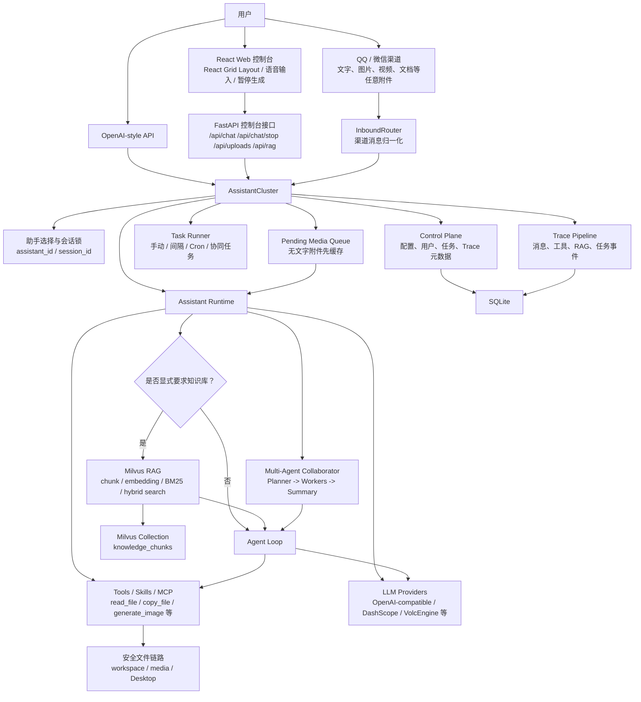

# nanobot个人生活账号助手


`nanobot个人生活账号助手` 是一个面向个人生活账号管理、日常知识问答和多渠道自动化的多助手 AI 应用工作台。它把大模型对话、RAG 知识库、MCP 工具扩展、自动化任务、Trace 观测、多渠道接入和多 agent 协同执行整合到同一个可运行的系统里。

这个项目的目标不是做一个简单的聊天页面，而是展示一个个人生活账号助手从“能调用模型”到“可配置、可观测、可扩展、可验证”的完整形态。

## 项目亮点

- 多助手集群：每个助手拥有独立模型、Prompt、工具、Skills、MCP、工作区和 token 配额。
- 多 agent 协同：支持 `Planner -> Workers -> Summary` 的协同执行流程，并在 Trace 中分阶段展示。
- Milvus RAG：基于 Milvus 的知识文档入库、分块、去重、向量检索、BM25 检索和混合召回。
- MCP 扩展：支持全局与助手级 MCP server 配置、校验、探测和工具白名单。
- 自动化任务中心：支持手动、间隔、Cron、重试、退避、条件流和任务级协同模式。
- 可观测性：支持对话 Trace、工具事件、RAG 证据、协同执行视图、token 用量和任务运行记录。
- 多入口接入：支持 Web 控制台、OpenAI-style API、QQ、微信等入口。
- React 可拖拽工作台：基于 React + React Grid Layout 实现卡片拖放、自动补位、四边缩放、边界约束和布局持久化。
- Web 语音输入：控制台聊天框支持浏览器 Web Speech API 语音识别，识别结果可直接写入输入框。
- 工程化交付：包含测试、ruff、build、pip-audit、安全配置、启动/停止脚本和面试展示文档。

## 适用场景

- 构建个人生活账号助手或团队内部 AI 助手工作台。
- 展示 AI 应用工程开发能力。
- 验证多模型、多助手、多工具、多渠道协同方案。
- 将知识库接入业务问答、项目巡检、日报生成、内容生产或研发辅助流程。
- 作为面试作品讲解 RAG、Agent、MCP、任务调度、Trace 和工程化取舍。

## 系统架构



这张图对应当前运行时的真实链路：

- Web 控制台已经迁移到 React，页面卡片由 React Grid Layout 负责拖放、四边缩放、碰撞处理、自动补位和布局持久化。
- Web 发送对话时会创建可取消的请求，点击「暂停/终止生成」后前端 `AbortController` 会中断请求，后端 `/api/chat/stop` 会取消当前 session 的 active chat task。
- QQ / 微信 / Web 上传的任意格式附件会先进入受控 media 目录；如果没有文字指令，运行时只进入 Pending Media Queue，不立即调用模型。
- 用户随后补充文字指令时，Pending Media 会与本轮文本合并，助手可以通过 `copy_file` 等工具把文件安全复制到桌面或 workspace。
- RAG 不再默认每轮检索，只有用户明确说「根据知识库 / 查询知识库 / 参考文档」等触发语时，才会走 Milvus + BM25 + 向量混合召回。

## 技术栈

### 后端

- Python 3.11+
- FastAPI：Web 控制台与管理 API
- aiohttp：OpenAI-style API 服务
- Typer：CLI 命令入口
- Pydantic v2：配置和数据模型
- SQLite：控制面数据存储
- Argon2：密码哈希
- Loguru：运行日志
- croniter：Cron 调度解析

### AI 与检索

- OpenAI-compatible provider abstraction
- DashScope / OpenAI / Anthropic / OpenRouter / Gemini / Ollama / VolcEngine 等 provider 接入
- Milvus
- sentence-transformers
- rank-bm25
- MCP
- Skills
- Tool use / function-style 工具调用

### 前端

- React 18
- React DOM
- React Grid Layout
- esbuild
- HTML / CSS
- Web Speech API
- localStorage 布局持久化
- 面向控制台场景的工作台式 UI

### 基础设施

- Docker / Docker Compose
- WSL2
- Milvus / etcd / minio
- Windows PowerShell 启动和停止脚本

## 核心模块

```text
nanobot/
├─ nanobot/
│  ├─ agent/                # AgentLoop、上下文构建、工具执行
│  ├─ api/                  # OpenAI-style API
│  ├─ bus/                  # 内部消息总线
│  ├─ channels/             # QQ、微信等渠道适配
│  ├─ cli/                  # CLI 命令入口
│  ├─ cluster/              # 多助手集群、RAG、Trace、任务中心、多 agent 协同
│  ├─ config/               # 配置 schema 与加载逻辑
│  ├─ providers/            # 模型 provider 注册和封装
│  └─ skills/               # 内置技能模板
├─ web/                     # Web 控制台
│  ├─ index.html             # React 控制台挂载入口
│  ├─ react-src/main.jsx     # 控制台 React 组件、API 交互和网格布局
│  ├─ react-console.js       # esbuild 生成的浏览器端 bundle
│  ├─ react-console.css      # React Grid Layout 与控制台补充样式
│  ├─ styles.css             # 主 UI 样式
│  ├─ app.js                 # 旧版原生控制台逻辑，保留作回退参考
│  ├─ resizable-layout.js    # 旧版原生拖拽布局，当前入口不再引用
│  └─ resizable-layout.css   # 旧版拖拽样式，当前入口不再引用
├─ tests/                   # 自动化测试
├─ evals/                   # AI 评测脚手架与报告
├─ docs/interview/          # 面试展示材料
├─ start-all.ps1            # Windows 一键启动
└─ stop-all.ps1             # Windows 一键停止
```

## 多助手与多 agent 协同

项目里“多助手”和“多 agent 协同”是两个层次：

- 多助手：系统中同时存在多个不同职责的助手，例如咨询、开发、写作、生图、投资等。
- 多 agent 协同：一次复杂任务可以由多个助手共同完成，流程是 `Planner -> Workers -> Summary`。

协同流程如下：

1. 主请求先按助手路由规则落到一个主助手。
2. 如果满足协同条件，`planner_assistant_id` 先生成任务拆解计划。
3. 多个 worker 助手并行或串行处理各自部分。
4. `synthesis_assistant_id` 汇总所有 worker 结果。
5. Trace 详情页展示 `Planner`、`Workers`、`Summary` 三段执行证据。

协同配置示例：

```json
{
  "cluster": {
    "collaboration": {
      "mode": "auto",
      "plannerAssistantId": "expert",
      "synthesisAssistantId": "",
      "workerAssistantIds": ["consult", "developer", "writer"],
      "maxWorkers": 3,
      "executionMode": "parallel",
      "minContentLength": 24
    }
  }
}
```

模式说明：

- `off`：关闭多 agent 协同。
- `auto`：根据任务长度和关键词自动触发。
- `always`：符合基础条件时强制走协同。

任务中心还支持任务级 `collaboration_mode`：

- `inherit`：继承全局协同配置。
- `off`：该任务关闭协同。
- `auto`：该任务自动判断是否协同。
- `always`：该任务强制使用多 agent 协同。

协同执行具备基础容错：

- 单个 worker 失败不会中断其他 worker。
- summary 模型失败时，会基于成功 worker 输出生成降级汇总。
- Trace 中会保留失败 worker、fallback summary 和错误原因。

## RAG 知识库

当前 RAG 后端使用 Milvus，控制面不再用 SQLite 存放 RAG 文档和 chunk。SQLite 负责控制面，Milvus 负责知识库。

RAG 能力包括：

- 文档上传
- 文本抽取
- 分块
- `content_hash` 去重
- 向量检索
- BM25 稀疏检索
- 混合召回
- 显式触发知识库检索
- RAG 状态检测
- 知识文档预览
- 回答引用来源
- Trace 中记录知识命中

项目已经补充助手级 RAG 资料库规划，见 [docs/rag/ASSISTANT_RAG_CATALOG.md](docs/rag/ASSISTANT_RAG_CATALOG.md)。对应的结构化来源清单位于 [docs/rag/assistant_rag_sources.json](docs/rag/assistant_rag_sources.json)，后续可以直接作为 Milvus 入库任务的数据源配置。

用于演示的虚构知识文档位于 [docs/rag/demo_personal_life_account_knowledge.md](docs/rag/demo_personal_life_account_knowledge.md)，Milvus RAG 的分步演示手册位于 [docs/rag/MILVUS_RAG_DEMO_GUIDE.md](docs/rag/MILVUS_RAG_DEMO_GUIDE.md)。

面试演示时建议按这个顺序讲：

1. 在「RAG 知识库」卡片确认 `MILVUS · 已连接`、collection、embedding 模型和 BM25 状态。
2. 上传 [docs/rag/demo_personal_life_account_knowledge.md](docs/rag/demo_personal_life_account_knowledge.md)，标题填写「个人生活账号助手演示知识库」。
3. 在检索框输入「家庭宽带每月哪天扣费，超过多少钱要提醒我？」验证 BM25 / vector / 混合召回。
4. 在主聊天框询问「请根据知识库告诉我：视频会员出现异地登录提醒时应该怎么处理？」。
5. 展示回答下方的引用来源，再打开 Trace 查看 `knowledge_hit` 事件。
6. 讲清楚链路：上传文档 -> 文本抽取 -> chunk -> embedding -> 写入 Milvus -> BM25 + 向量检索 -> RRF 融合 -> 注入上下文 -> 回答和 Trace 引用。

推荐检索策略：

- 对话默认不检索知识库，只有用户明确说「根据知识库」「查询知识库」「参考文档」「基于资料」等语句时，才调用 `_should_use_knowledge_context` 触发 RAG。
- 触发后按 `assistant_id` 和 `collection_key` 做 metadata filter，避免不同助手互相污染上下文。
- `consult`、`developer`、`expert` 优先检索官方 prompt、RAG、架构和项目本地文档。
- `investment` 默认只做投资教育和风险说明，不把静态 RAG 当作实时行情或投资建议来源。
- `image` 负责生图意图识别、提示词重写和模型能力说明，图片生成仍由图像模型执行。
- Trace 中建议展示命中的 `collection_key`、`source_name`、`score` 和 `source_url`。

配置示例：

```json
{
  "cluster": {
    "rag": {
      "uri": "http://127.0.0.1:19530",
      "token": "",
      "collectionName": "knowledge_chunks",
      "embeddingModel": "all-MiniLM-L6-v2"
    }
  }
}
```

## MCP 与工具扩展

项目支持全局 MCP 和助手级 MCP。一个 MCP server 可以通过 `stdio`、`sse` 或 `streamableHttp` 接入。

配置示例：

```json
{
  "tools": {
    "mcpServers": {
      "filesystem": {
        "type": "stdio",
        "command": "mcp-server-filesystem",
        "args": ["./"],
        "toolTimeout": 30,
        "enabledTools": ["*"]
      }
    }
  }
}
```

控制台支持：

- MCP 配置模板
- MCP 配置校验
- MCP 可达性探测
- 已加载 MCP 列表
- 工具白名单展示
- 配置异常提示

## 自动化任务中心

任务中心用于把项目从“被动聊天”扩展到“主动执行”。

支持能力：

- 手动执行
- 间隔执行
- Cron 执行
- 任务类型：通用、报告、知识摘要、渠道推送、图片生成
- 失败重试
- 重试退避
- 条件执行
- 最近一次阻塞原因
- 任务级多 agent 协同模式
- 执行结果同步到 QQ / 微信

条件执行包括：

- 仅在 RAG / Milvus 已连接时运行
- 仅在目标渠道在线时运行
- 距离上次成功执行至少 N 分钟

## Trace 与可观测性

Trace 是项目的核心调试入口。每次对话或任务执行都会记录：

- 用户输入
- 助手输出
- 工具事件
- RAG 命中证据
- token 用量
- 执行耗时
- 多 agent 协同视图

多 agent Trace 会单独展示：

- `Planner`：任务拆解计划
- `Workers`：每个执行助手的结果
- `Summary`：最终汇总或降级汇总

这使得一次 AI 决策不再是黑盒，而是可以在控制台中回放和解释。

## Web 控制台与拖拽布局

Web 控制台采用固定顶部导航 + React 多卡片网格工作台布局。当前页面不是普通静态三栏，而是一个可交互的 AI 管理工作台。

主要能力：

- 默认打开页面采用 12 栅格布局：左列 2 栅格、中间 8 栅格、右列 2 栅格。
- 默认卡片排布为：左上「助手集群」、左下「系统与插件状态」；中上「AI 咨询助手」、中下「RAG 知识库 / 自动化任务中心 / Traces & Events」；右上「Inspector 配置」、右下「用户管理」。
- 上下分界线默认对齐，底部卡片从同一水平线开始，页面打开后即填满控制台主体区域。
- 卡片可自由拖拽换位，释放后由网格算法自动寻找合适位置并补位。
- 拖拽时使用 React Grid Layout 的占位预览，避免卡片互相覆盖。
- 每张卡片四条边都提供缩放手柄，支持从上、下、左、右调整尺寸。
- 所有卡片使用统一的小最小尺寸约束，当前为 `CARD_MIN_W = 2`、`CARD_MIN_H = 3`，避免某些卡片因最小尺寸过大导致手柄拖不动。
- 卡片缩小时，内部表单、列表、详情区会自动出现滚动条，避免内容被裁切。
- 拖动或缩放后会进行布局归一化，优先把所有卡片压回网格边界内，避免底部卡片显示不完整。
- Inspector 配置面板保持常开，移除了无实际意义的「收起」按钮。
- 聊天输入区支持附件上传、语音识别和文本发送。语音识别基于 `SpeechRecognition / webkitSpeechRecognition`，识别文本会写入输入框。
- 布局写入 localStorage，key 为 `nanobot-react-grid-layout-v13`，刷新后保留用户调整。升级 key 时会自动使用新的默认布局。

实现特点：

- 使用 React 组件拆分助手集群、会话、Inspector、RAG、任务、Trace、用户管理等功能卡片。
- 使用 React Grid Layout 承担网格拖放、碰撞处理、自动补位和缩放约束。
- 使用 `normalizeLayout` 对拖动和缩放后的布局做边界归一化，防止卡片被挤出可视区域。
- 使用 esbuild 将 `web/react-src/main.jsx` 打包为 `web/react-console.js`，由 FastAPI 静态资源直接提供。
- API 仍复用原有 FastAPI 控制台接口，低侵入迁移前端实现。
- 保存网格 `x/y/w/h` 状态，窗口尺寸变化后由网格容器自适应。

## 附件与本机文件处理

- Web、微信等渠道收到图片、视频、PDF、文档等非文字附件时，如果用户没有同时给出文字指令，运行时只缓存附件路径，不立即调用 AI 生成回答。
- 用户随后发送文字指令时，系统会把前面缓存的附件和本轮文本合并成一次有效请求，避免“刚发图片就乱回答”。
- QQ / 微信收到的图片、视频、音频、压缩包、Office 文件、安装包等任意附件会下载到受控 media 目录，并通过 `media` 路径传入助手。
- 新增 `copy_file` 工具，支持复制任意二进制文件；适合“把刚才微信/QQ 发的文件放到桌面”这类任务。
- 集群助手仍强制 `restrict_to_workspace=True`，文件工具默认只允许访问助手 workspace、media 上传目录和用户桌面目录，避免放开整块磁盘。
- 桌面目录由系统自动识别；测试或特殊部署可通过 `NANOBOT_DESKTOP_DIR` 指定。

## 启动方式

### 0. 从 Gitee 克隆后的最小启动验证

如果是第一次从 Gitee 下载项目，推荐先跑这个最小链路，确认前端、Python 依赖和 Web 控制台都能启动：

```powershell
git clone https://gitee.com/jiexusheng666/nanobot-life-assistant.git
cd nanobot-life-assistant

npm ci
npm run build:web

uv run nanobot onboard
uv run nanobot cluster serve --web-only
```

然后打开：

```text
http://127.0.0.1:8711
```

这条链路只启动 Web 控制台和多助手控制面，不强制启动 QQ / 微信渠道，也不要求 Milvus 立刻可用。需要 RAG 演示时，再启动 Docker / Milvus 并使用完整启动脚本。

### 1. 安装依赖

```bash
uv sync --all-extras
npm install
npm run build:web
```

### 2. 初始化配置

```bash
uv run nanobot onboard
```

默认配置文件：

```text
~/.nanobot/config.json
```

### 3. 启动 Web 控制台

```bash
uv run nanobot cluster serve --web-only
```

默认地址：

```text
http://127.0.0.1:8711
```

### 4. 启动完整集群

```bash
uv run nanobot cluster serve
```

完整集群会启动：

- Web 控制台
- Assistant Cluster
- 已启用渠道
- 任务调度器

### 5. 启动 OpenAI-style API

```bash
uv run nanobot serve
```

默认地址：

```text
http://127.0.0.1:8900
```

## Windows 一键启停

启动：

```powershell
.\start-all.ps1
```

常用参数：

```powershell
.\start-all.ps1 -WebOnly
.\start-all.ps1 -SkipMilvus
.\start-all.ps1 -NoBrowser
.\start-all.ps1 -NoLogTail
```

停止：

```powershell
.\stop-all.ps1
```

常用参数：

```powershell
.\stop-all.ps1 -SkipMilvus
.\stop-all.ps1 -StopDockerDesktop
```

脚本会处理：

- WSL2 / Docker 状态检查
- Milvus 容器启动或停止
- Web 控制台启动
- OpenAI-style API 启动
- 日志输出
- Web session 清理

## OpenAI-style API

当前 API 是兼容层，不是 100% OpenAI 协议复刻。

支持：

- `/v1/chat/completions`
- 多消息输入
- 基础流式输出
- `/v1/models`
- usage 统计
- 同 session 串行处理

当前限制：

- 暂不完整支持 `tool_calls`
- 暂不完整支持 OpenAI 全量错误码矩阵
- 多模态输入协议只做了项目内必要能力

## 安全模型

Web 控制台默认偏生产安全：

- 默认启用登录鉴权
- 首次启动需要初始化管理员账号
- CSRF 防护
- `Secure / HttpOnly / SameSite` Cookie
- Argon2 密码哈希
- 关闭鉴权必须显式进入开发模式

更多说明见 [SECURITY.md](./SECURITY.md)。

## AI Evals

项目提供了基础 AI 评测脚手架：

- 数据集：[evals/datasets/basic_eval_cases.jsonl](./evals/datasets/basic_eval_cases.jsonl)
- 运行器：[evals/runner.py](./evals/runner.py)
- 示例报告：
  - [evals/reports/basic_eval_report.json](./evals/reports/basic_eval_report.json)
  - [evals/reports/basic_eval_report.md](./evals/reports/basic_eval_report.md)

运行：

```bash
python evals/runner.py --dataset evals/datasets/basic_eval_cases.jsonl
```

导出报告：

```bash
python evals/runner.py \
  --dataset evals/datasets/basic_eval_cases.jsonl \
  --json-out evals/reports/latest_eval_report.json \
  --md-out evals/reports/latest_eval_report.md
```

## 本地开发与验证

前端单元测试：

```bash
npm run test:web:unit
```

前端 E2E 冒烟测试：

```bash
npm run test:web:e2e
```

前端视觉回归测试：

```bash
npm run test:web:visual
```

完整前端检查：

```bash
npm run test:web
```

静态检查：

```bash
python -m ruff check .
```

测试：

```bash
python -m pytest tests
```

构建：

```bash
python -m build --sdist --wheel
```

依赖安全扫描：

```bash
python -m pip_audit
```

## 验证多 agent 协同

推荐使用任务中心验证，链路最完整。

1. 启动项目。

```powershell
.\start-all.ps1
```

2. 打开 Web 控制台。

```text
http://127.0.0.1:8711
```

3. 在任务中心新建任务。

```text
任务名称：多 Agent 协同验证
执行助手：consult
任务类型：报告摘要
协同模式：强制协同
调度方式：手动
```

任务提示词示例：

```text
请多角度分析这个项目如何用于 AI 应用工程开发面试，分别从架构、RAG、任务中心、MCP、风险边界五个角度给出建议。
```

4. 保存任务并点击“立即运行”。
5. 打开 Trace 详情。

成立标准：

- Trace 中出现“协同执行视图”。
- `Planner` 有任务拆解。
- `Workers` 中出现多个助手结果。
- `Summary` 有最终汇总或降级汇总。
- 事件流包含 `collaboration_start`、`collaboration_plan`、`collaboration_worker_result`、`collaboration_summary`。

## 面试展示资源

仓库内置了面向“AI 应用工程开发”面试的材料：

- [演示脚本](./docs/interview/DEMO_SCRIPT.md)
- [系统设计答辩](./docs/interview/SYSTEM_DESIGN.md)
- [部署故事](./docs/interview/DEPLOYMENT_STORY.md)
- [已知问题与取舍](./docs/interview/KNOWN_ISSUES.md)
- [Milvus RAG 演示手册](./docs/rag/MILVUS_RAG_DEMO_GUIDE.md)
- [RAG 演示知识文档](./docs/rag/demo_personal_life_account_knowledge.md)

建议面试演示主线：

1. 启动项目和 Web 控制台。
2. 展示 React 可拖拽控制台：说明默认 12 栅格布局，拖动卡片换位，拖动四边手柄调整卡片大小，说明网格占位、边界归一化和自动补位如何避免重叠与溢出。
3. 展示多助手配置。
4. 在聊天框演示附件上传、文本输入和语音识别按钮。
5. 上传或检索 RAG 知识库。
6. 执行一次多 agent 协同任务。
7. 打开 Trace 展示 Planner、Workers、Summary。
8. 展示 token、RAG 引用和任务运行记录。

## 已知边界

- 控制面当前使用 SQLite，适合单机和小团队场景；更大规模部署可以迁移到 PostgreSQL。
- RAG 已接入 Milvus 和混合召回，但仍可继续增强 reranker、文档版本管理和引用去重。
- 多 agent 协同目前是 `Planner -> Workers -> Summary` 的线性编排，还不是完整 DAG 工作流引擎。
- 任务中心具备 Cron、条件流和协同模式，但还不是通用 BPM 系统。
- 前端已迁移到 React Grid Layout，适合当前卡片数量；如果后续扩展到更复杂的仪表盘，可以继续引入多布局模板、权限级布局和服务端布局同步。
- Web 语音识别依赖浏览器能力和麦克风权限；不同浏览器对 `SpeechRecognition` 的支持程度不同。
- OpenAI-style API 是项目兼容层，不追求完整复刻 OpenAI 所有协议细节。
- QQ / 微信主动同步发送依赖已有可回复会话或明确目标账号。

## 后续方向

- 多 agent 协同支持更复杂的 DAG 与人工确认节点。
- RAG 质量评测、reranker 和引用去重。
- 更完整的成本治理和用户级配额。
- 更多 MCP 模板和能力市场。
- 更完整的部署方案和多环境配置。
- 将 AI Evals 报告接入控制台指标面板。

## 许可证

[MIT](./LICENSE)
